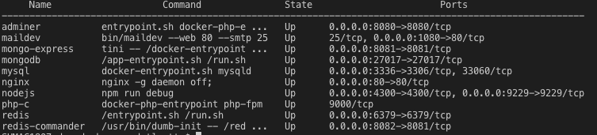
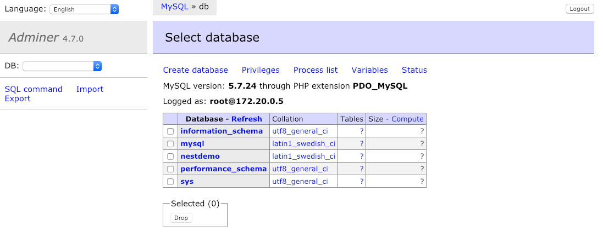
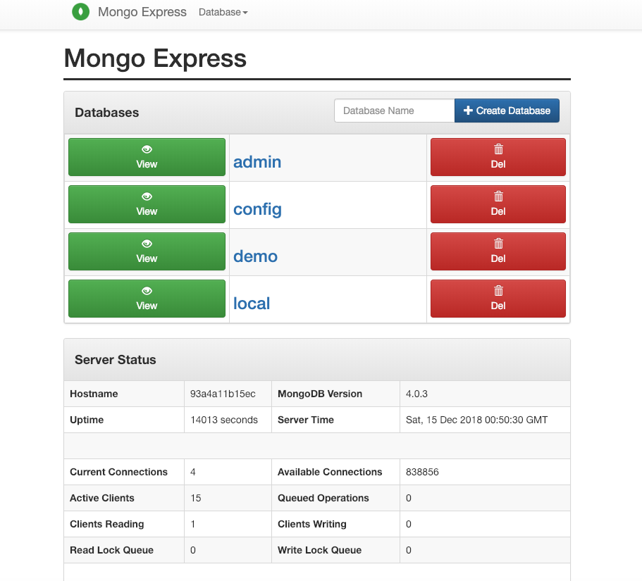
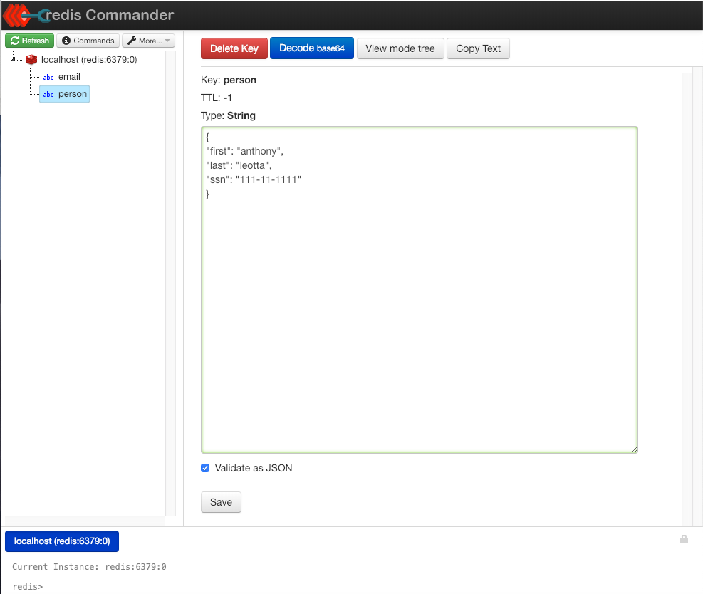
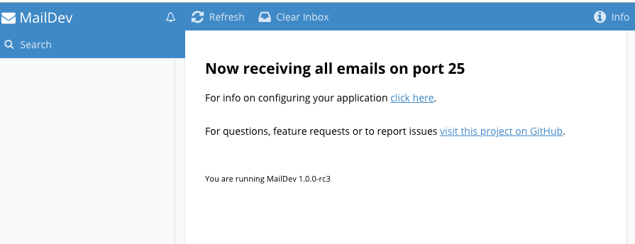

# dev-docker-seed

## A fully containerized development seed project

* nginx 
  * serves plain HTML
  * serves PHP
  * reverse to Proxy to a node.js server
* sample node.js server written in JavaScript
  * live code reloading with nodemon
  * interactive step debugging with MS Code Studio
  * edit cide using a shared volume
* sample PHP website
  * interactive step debugging with MS Code Studio
  * edit cide using a shared volume
* redis
  * persistant data due to a volume
* mysql
  * persistant data due to a volume
  * SQL Query log saves on host due to a volume
  * Database bakups to host due to a volume
* mongodb
  * persistant data due to a volume
* redis manager
  * using redis-commander
* mysql database manager
  * using adminer
  * Support for
    * MySQL
    * SQLite 3
    * SQLite 2
    * PostgresSQL
    * Oracle
    * MS SQL
    * Firebird
    * SimpleDB
    * MongoDB
    * ElacticSearch
    * ClickHouse
* mongodb database manager      
  * using mongo-exopress
* Mail Client
  * test email notifications
  * send and recieve emails
  * map to a domain for testing
* Mail Server
  * maildev

## For the impatient

* This project requires that you have Docker installed.

* To build the services

```
docker-compose build
```

* To run all the services
```
docker-compose up -d
```

* To stop
```
docker-compose stop
or
docker-compose down 
```
* stop will stop services
* down will stop and remove containers, networks, images, and volumes


## About
[dev-docker-seed](https://github.com/datajango/dev-docker-seed)

by Anthony Leotta (the datajango)

This demo keeps growing, it started as a simple idea: "How can you create Node.Js back-ends using Typescript?"  The answer is: NestJS.   Along the way, I realized that the preferred way to develop back-ends is to do it locally on whatever your OS of choice is.  I running at the time of this writing a mess of OSes including : MacOS Mojava 10.14.2, Windows 10 Pro, Linux Ubuntu 16.04, 17.10 and 18.04. I need a way to develop equally as well on all my platforms.

My "must have" features are:

* 100% containerized - I install NOTHING locally.
* Ultra fast container reconfiguration
* Interactive Debugging
* Live Code Watching and rebuilds
* Emmet -- bow thy head to the awesome power of Emmet ---
* Linting
* Code completion
* Preferred IDE is Visual Code Studio
* Choice of using any database on this list: MySQL / MariaDB / Postgres / SQLite / Microsoft SQL Server / Oracle, mongodb
* Choice of using redis
* Support ES6, ES7, ES8
* Support TypeScript (Obviously the entire point of this exercise)
* Include a test email server
* Browser based SQL Database Manager - I install NOTHING.
* Browser based Mongo Database Manager - I install NOTHING.
* SSL https for testing
* Domain Name aliasing for testing
* Unit tests

I tried Vagrant and Virtual Box but quickly rejected it because it forced me to rebuild my images from scratch every time.  I adopted Docker and Docker Compose as a way to quickly build up a fully containerized development environment.  Once I started down the Docker path, setting up a fully featured development environment became so easy that I was able include features I hold only dreamed about.

Make no mistake: Docker is the greatest thing to ever happen to software development.


## Running

```
docker-compose build
docker-compose up -d
```



## Standard JavaScript Node.js 

The following describes the a node.js server project written in JavaScript.

### Nodemon 

12/13/2018 - I had to add a nodemon.json configuration in order to get nodemon working. It was then that I also realized that the node_modules folder can be either in the image or shared using a volume.  This is somewhat surprising to me because it changes the way I think about npm install and containers in general.  Running 'npm install' in a Dockerfile against a volume, in effect is the same as running 'npm install' on the local machine.  What I did was change my volume to point to the 'src' folder under nodejs.

nodemon.json:
```
{
    "restartable": "rs",
    "verbose": true,
    "delay": "500ms",
    "watch": [
      "src/",
      "node_modules/"
    ],
    "ext": "js",
    "args": [
      "--inspect=9229"
    ]
  }
```

### Step debugging in MS Code Studio

Start node with debugging turned on

* --inspect tells Node that we want to run our app in debug mode.
* by adding -brk we also make sure that the app stops at the first line, so we have enough time to open up the inspector
* adding =0.0.0.0 opens up the debugger to connections from any IP.

```
node --inspect-brk=0.0.0.0
```

In MS Code Studio, add a debug configuration:
```
{
  "name": "Docker: Attach to Node",
  "type": "node",
  "request": "attach",
  "port": 9229,
  "address": "localhost",
  "localRoot": "${workspaceFolder}",
  "remoteRoot": "/",
  "protocol": "inspector"
}
```

## Terminal for nodejs

```
docker-compose exec nodejs bash
```

## Testing

### Phase 1

To see that all the various components are running, execute curl at the command line. If all the server respond, move the next next phase.

Main HTML/PHP Website
```
curl -i localhost:80
```

MailDev Website
```
curl -i localhost:1080
```

Adminer Website
```
curl -i localhost:8080
```

Simple Node.Js Server
```
curl -i localhost:4300
```

### Phase 2

* Test mysql at the command line
```
docker-compose exec mysql /bin/bash
```

* This command will run the mysql client and return the version of the currently running server.
```
docker exec -i mysql mysql -uroot -pmysql  <<< "select version();"
```

* dump the mysql database without having to use a password
  * gzipped
```
docker-compose exec mysql mysqldump demo | gzip > backups/demo.sql.gz
```
  * plain
```
docker-compose exec mysql mysqldump demo | cat > backups/demo.sql
```

## Steps to Create this ProjectSetup

Dependencies

```
    npm init
    npm i typescript -g
    npm i typescript --save-dev
    tsc --init or ./node_modules/.bin/tsc --init
```

Let’s add just two more options to that base configuration tsconfig.json:

```
{
  "compilerOptions": {
    "target": "es5",
    "module": "commonjs",
    "strict": true,
    "outDir": "dist",
    "sourceMap": true
  }
}
```
## Docker

The docker-compose environment includes :

* mysql
  * [mysql](https://docs.docker.com/samples/library/mysql/#-via-docker-stack-deploy-or-docker-compose)
* adminer
  * [Adminer](https://hub.docker.com/_/adminer/)
  * 
* mongo-express
  * [mongo-express Official Website](https://github.com/mongo-express/mongo-express)
  * 
* redis-commander
  * [redis-commander Official Website](http://joeferner.github.io/redis-commander/)
  * 

* Maildev Client
  * For sending email
  * 
* nginx
* php-fpm

### Cleanup

* Stop all containers
```
docker stop $(docker ps -a -q)
```
* Delete all containers
```
docker rm -f $(docker ps -a -q)
```
* Delete all images
```
docker rmi -f $(docker images -q)
```
* Delete all volumes
```
docker volume rm $(docker volume ls -q)
```

* All commands together to make easier cut-n-paste
```
docker stop $(docker ps -a -q)
docker rm -f $(docker ps -a -q)
docker rmi -f $(docker images -q)
docker volume rm $(docker volume ls -q)
```

### Docker Status

* list containers, also can be shown with docker ps
```
docker container ls
```
* list images, there is also the command docker images
```
docker image ls
```
* list volumes
```
docker volume ls
```
* lists networks
```
docker network ls
```
*  lists the number of containers and image, as well as system wide information regarding the Docker installation
```
docker info
```


## MongoDB

* run bash 
```
docker-compose exec mongodb bash

mongod --version

db version v4.0.3
git version: 7ea530946fa7880364d88c8d8b6026bbc9ffa48c
OpenSSL version: OpenSSL 1.1.0j  20 Nov 2018
allocator: tcmalloc
modules: none
build environment:
    distmod: debian92
    distarch: x86_64
    target_arch: x86_64

mongo
  show dbs    
```

## Mongo-Express Admin Interface

Web-based MongoDB admin interface, written with Node.js and express

* [mongo-express](https://docs.docker.com/samples/library/mongo-express/)

```
docker-compose exec mongo-express bash
```

## Nest JS Demo

This project was created from inside the container.

``
mkdir nest-js-app && cd nest-js-app
touch Dockerfile .dockerignore
docker-compose build
docker-compose up -d
docker-compose exec nest-js-app bash
nest new .
npm install
```

## Planned Features

All these features will be add in the the next couple weeks.

* add Unit testing
* add CI/CD examples
  * Heroku
  * Linode
  * Digital Ocean
  * AWS
* global Production, Development, QA Environments
  * disabke debugger for production and QA Environmenfs
* Environment variable passing
* mysql demo
  * add create schema in docker container build phase
  * add support for migrations
* add nestjs demo
* nodejs server demo
  * add mysql example
  * add mongodb example
  * add redis example
  * add oauth2
  * add send email example
  * add bootstrap version
  * add material version  
  * add graphQL
  * add an ORM
  * add migrations
* php server demo
  * add mysql example
  * add mongodb example
  * add redis example
  * add oauth2
  * add send email example
  * add bootstrap version
  * add material version 
  * add composer to docker image 
  * add an ORM
  * add migrations
* html5 demo
  * add bootstrap version
  * add material version
* nodejs microservices demo
  * add apis to nginx first
  * [Building Microservices: Using an API Gateway](https://www.nginx.com/blog/building-microservices-using-an-api-gateway/)
* react client demo
* angular client demo
* vuejs client demo
* oauth2 client demo
* add postgreSQL demo


## Resources

* [An Exhaustive Guide to Writing Dockerfiles for Node.js Web Apps](https://blog.hasura.io/an-exhaustive-guide-to-writing-dockerfiles-for-node-js-web-apps-bbee6bd2f3c4)
* [Dockerizing a Node.js web app](https://nodejs.org/en/docs/guides/nodejs-docker-webapp/)
* [npm-package.json](https://docs.npmjs.com/files/package.json)
* [Docker Tips : Development With Nodemon](https://medium.com/lucjuggery/docker-in-development-with-nodemon-d500366e74df)
* [Setup Node.js, Apache and an nginx reverse-proxy with Docker](https://medium.com/@francoisromain/setup-node-js-apache-nginx-reverse-proxy-with-docker-1f5a5cb3e71e)
* [Building Your First Node App Using Docker
](https://www.javascriptjanuary.com/blog/building-your-first-node-app-using-docker)
* [Nest framework TypeScript starter](https://github.com/nestjs/typescript-starter)
* [NestJS Docs](https://docs.nestjs.com/)
* [nodemon utility](https://nodemon.io/)
* [Docker](https://docs.docker.com/)
* [Docker Compose](https://docs.docker.com/compose/compose-file/)
* [MySQL in Development](https://serversforhackers.com/c/mysql-in-dev-docker)
